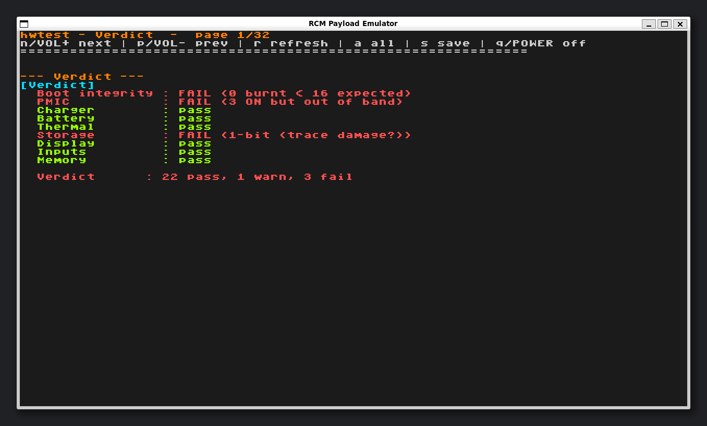

# hwtest RCM



A read-only RCM (Recovery Mode) payload that probes every BPMP-side IC the
Switch boot ROM hands off to, then reports identity / status / faults to the
LCD and UART_B (Joy-Con right rail, 115200 8N1). The BPMP is the Boot and
Power Management Processor, the small ARM7 core that runs before the main CPU
comes up. That is what an RCM payload executes on, and it bounds what can be
tested. Output is also captured into a heap buffer that gets written to
`backup/<emmc_serial>/hwtest.txt` on the SD card.

The intended audience is repair techs working on Erista or Mariko consoles
(handheld, V2, OLED, Lite). The output is colour-coded so a unit with a
borderline reading or a real fault stands out without reading every line.

## Building

The Hekate source tree is vendored as a git submodule at
`third_party/hekate`. Initialize it before the first build:

```sh
git submodule update --init
export DEVKITARM=/opt/devkitpro/devkitARM   # or wherever yours lives
make                                        # produces both variants
```

`make` runs twice. The first pass uses `DEBUG_UART_PORT=1` and produces the
default build at `build/hwtest.bin`. The second pass uses `JC_PROBE=1` and
produces `build-jc/hwtest_jc.bin`. The two builds are mutually exclusive on
the wire because the Joy-Con stack needs UART_B at 1 Mbaud with hardware
flow control while the debug log uses 115200 8N1, so only one variant can
run at a time.

| Variant | UART_B owner | Use it when |
|---|---|---|
| `hwtest.bin` (default) | debug log @ 115200 8N1 | tech is capturing UART output for diagnosis |
| `hwtest_jc.bin` | Joy-Con stack @ 1 Mbaud | tech needs Joy-Con detection / FW version |

The default build is what you want 90% of the time.

## Running

Inject like any other RCM payload (fusee-launcher, TegraRcmGUI, modchip, RCM
jig). The unit boots into the diagnostic dump within ~3 seconds, writes the
SD report, and lands on the on-LCD pager.

If the SD slot is empty / faulty / the unit was injected without a card, the
payload still boots and runs. The save step is skipped cleanly with an `[save]
SD not ready` line on UART; the LCD pager remains usable.

| Key | Action |
|---|---|
| `n` / space / VOL+ | Next page |
| `p` / `b` / VOL- | Previous page |
| `r` | Refresh current LCD page |
| `a` / `A` | Refresh ALL probes (re-emit full UART dump) |
| `G<name>\n` | Refresh just the named group (host viewer uses this) |
| `s` / `S` | Re-write the SD report file |
| `q` / POWER | Power off the console |

## What's reported

Ten logical pages (some span multiple LCD-sized sub-pages). The Verdict
page is index 0, so the pager opens on the summary and you only page into
the detail when something needs chasing:

| Page | Probes |
|---|---|
| Verdict | rolled-up pass/warn/fail per subsystem, plus cross-checks across SoC / fuses / charger / display / touch / battery / eMMC / thermal / USB-PD / fuel-gauge. Shown first on the pager and written first into the SD report |
| SoC | HIDREV chip ID + major/minor |
| Fuses | identity + speedo / IDDQ + lot/wafer + public key + SBK/DK + KFUSE |
| Power & charging | MAX77620 + GPIOs + regulators + 5V + battery + charger + USB-PD + thermal + fan |
| Memory & clocks | LPDDR4 mode regs + CLK_RST raw + decoded rates |
| Storage | SD + eMMC + partitions + health + GPT + BOOT0/pkg1 + AutoRCM + SD content scan, plus PRODINFO: serial, CAL0 body SHA-256, config ID, product model vs SoC, LCD vendor vs fitted panel, WLAN/BD MACs, battery lot, USB-C PD rev, touch IC, IMU, sticks, region, speaker calibration |
| Wireless | Bluetooth radio: full CYW4356 power-up, then HCI over UART-D. Reports whether the radio answers and identifies itself |
| Display | DSI panel ID + backlight PWM + GPIO state |
| Inputs | touch FW + Joy-Con rails + buttons + AC adapter |
| Raw state | GPIO pin census + UART debug port + reset reason + PMC scratch |

### Terms used in that table

| Term | Meaning |
|---|---|
| **HIDREV** | Tegra chip identity register: chip ID plus major/minor revision |
| **IDDQ** | Quiescent supply current, a factory-measured leakage figure burnt into fuses |
| **speedo** | Factory-measured silicon speed grade, also fuse-burnt |
| **SBK / DK** | Secure Boot Key / Device Key, per-console fuse-burnt secrets |
| **KFUSE** | Separate fuse block holding the HDCP/display key data |
| **PMC** | Power Management Controller, the Tegra block holding scratch registers and reset reason |
| **DSI** | Display Serial Interface, the MIPI link to the LCD panel |
| **PWM** | Pulse-Width Modulation, used here for backlight brightness |
| **LPDDR4** | The DRAM standard the Switch uses |
| **CLK_RST** | Tegra's Clock and Reset Controller |
| **GPT** | GUID Partition Table, the eMMC partition layout |
| **BOOT0 / pkg1** | eMMC boot partition and the first-stage bootloader package in it |
| **AutoRCM** | A deliberately corrupted boot0 that forces the console into RCM at power-on |
| **PRODINFO** | The factory calibration partition, encrypted with per-console keys |
| **CAL0** | The structure inside PRODINFO holding that calibration data |
| **BD MAC** | Bluetooth device address (the radio's MAC-equivalent identifier) |
| **IMU** | Inertial Measurement Unit, the console's accelerometer/gyro |
| **USB-PD** | USB Power Delivery, the charging negotiation protocol |
| **eMMC** | The soldered-down internal flash storage |

## Bluetooth radio probe

Most of hwtest reads. This probe writes, and it is worth knowing what it does.

The Switch's Broadcom CYW4356 carries WLAN on **PCIe** and Bluetooth on a
plain 4-wire UART (Tegra UART-D, `0x70006300`). PCIe is out of reach from a
payload: BDK (hekate's Bare Development Kit, the vendored hardware library)
has none of the pieces needed to bring a PCIe link up: no AFI (Address
Framing Interface, the controller's register window), no PLLE (the PCIe
phase-locked loop) and no UPHY (Universal PHY) lane initialisation.

The UART is reachable, though, and both radios share one package and one
supply. So if Bluetooth answers HCI (Host Controller Interface, the standard
Bluetooth host-to-controller command protocol), the module is powered, clocked
and executing code, so a Wi-Fi fault is downstream of the chip: the PCIe
link, the WLAN core, or the antenna.

To get there the probe performs a real cold power cycle: it parks every radio
control line in a known state, drives `BT_REG_ON` (PH4) and `WL_REG_ON` (PH1)
low together, holds them, then raises `BT_REG_ON` to produce a genuine POR
(Power-On Reset, the chip's internal reset, which is released when
`BT_REG_ON` rises and can hold the part for up to 110 ms afterwards).

The power cycle is not optional, because two of these pins are *straps* --
sampled once, a few milliseconds after POR deassertion, then latched until the
next one. Re-pulsing `BT_REG_ON` without a low period changes nothing; the
part keeps whatever mode it latched first.

* `BT_HOST_WAKE` (**PH5**, chip `BT_GPIO_1`) selects the host transport. Held
  low across the edge it latches **SPI**, and the part then ignores the UART
  entirely. The probe leaves it high-Z with no pull so the chip's own
  internal pull-up wins and UART is selected.
* `BT_GPIO4` (**PK2**, on port K, not H) is the one strap the datasheet
  tabulates: driven high, the ROM hunts for an external serial flash instead
  of presenting HCI. The probe holds PK0-PK2 as inputs.

The remaining lines (`BT_REG_ON`, `WL_REG_ON`, `BT_DEV_WAKE` on PH3) are
ordinary control and wake signals, not straps. They still have to be in a
defined state across the edge, but nothing latches them as configuration.
`WL_REG_ON` is restored before the probe returns.

It also self-tests. A 16550 internal loopback runs first, proving the clock,
divisor, FIFOs and helper routines without involving a single pad. **A radio
that stays silent is only reported as a failure when that loopback passed** --
otherwise the fault is on our side of the pads and nothing is recorded against
the radio.

Verified against four consoles spanning both SoC generations. Three healthy
units, two Mariko and one Erista, each answer with a valid Command Complete
(`04 0E 04 01 03 0C 00`) and identify as Broadcom (`0x000F`). One faulty
Erista, reporting error 2110-1118 on Wi-Fi, never releases its internal
pull-up on `BT_HOST_WAKE` and never asserts the transport-ready handshake,
across three power-cycle arms, four flow-control variants and eight baud
rates. Its PRODINFO calibration is intact, which puts the fault in the module,
its supply, or its solder.

## Host viewer (`host_tools/hwtest_viewer.py`)

ImGui front-end that connects to the same UART, parses the line-oriented dump,
and shows it as a clickable page list with green, yellow, or red severity
colouring. The toolbar exposes the pager keys (`n`, `p`, `r`, `s`, `q`) plus a
"Refresh group" button that sends a `G<group>\n` command. That refreshes just
the selected group on the host side without touching the LCD.

```sh
pip install -r host_tools/requirements.txt
python host_tools/hwtest_viewer.py --port /dev/ttyUSB0
# or replay a saved capture (no console needed):
python host_tools/hwtest_viewer.py --replay path/to/uart_capture.txt
```

The Switch UART runs at 1.8 V. Use a level-shifter between the Tegra rail
and any USB-TTL cable that doesn't natively support 1.8 V. For wiring the
Joy-Con right rail as a UART tap, see this gbatemp guide:
<https://gbatemp.net/threads/how-to-make-a-joycon-rail-uart-to-capture-boot-log.625784/>.

## Layout

```
main.c               - probe sequence + sinks + pager + UART command loop
emmcsn.c             - Hekate-style backup/<emmc_serial>/<sub>/<file> path
diskio.c, ffconf.h   - FatFS glue + config (vendored from the Hekate bootloader)
exception_handlers.S - boot relocator (vendored from the Hekate bootloader)
gfx/                 - LCD driver (vendored from the Hekate bootloader)
stubs.c              - minerva_deinit no-op
link.ld              - link script
Makefile             - devkitARM build for both variants
host_tools/          - ImGui + pyserial UART viewer (parser, GUI, replay)
```

## Acknowledgements

Heavy reliance on the work of:

- [Hekate / BDK](https://github.com/CTCaer/hekate)
- [Lockpick_RCM](https://github.com/shchmue/Lockpick_RCM)
- [switchbrew.org](https://switchbrew.org/wiki/)
